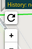

Refresh
=======
IITC-Plugin for the game Ingress.

Install
=====
Link: [Plugin](https://github.com/IITCPlugins/Refresh/blob/main/dist/iitc_plugin_Refresh.user.js)

Usage
=====

Use this button instead of hammering "F5".

It will refresh portal informations without reloading the whole map.
This saves a lot of time and data-transfers. Also you won't lost current session data just for forcing a map update.

- it rotates if the map is still loading
- it fades in after a refresh call to prevent you from doing to much calls

Notes:
- regular IITC will refresh data every 5min
- ingress-intel-server won't give you realtime data

